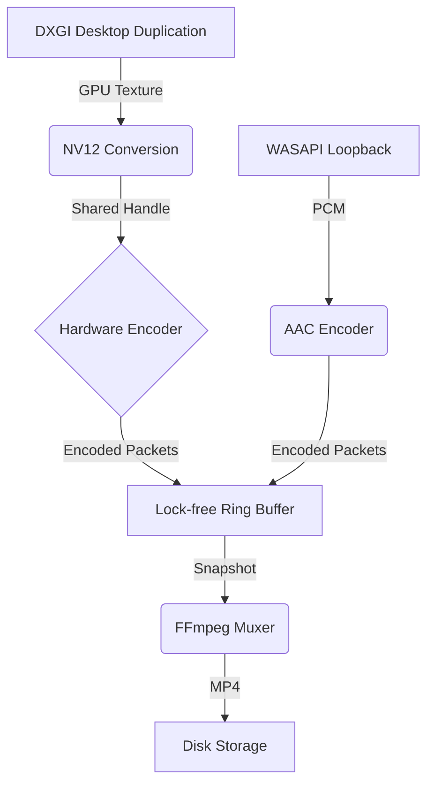

# LiteClip Replay

[](https://www.rust-lang.org)
[](https://www.microsoft.com/windows)
[](LICENSE)

A lightweight, high-performance Windows screen recorder with **retroactive replay buffer** functionality. Capture your gameplay or desktop with near-zero overhead and save clips on demand.

---

## 🚀 Key Features

- **Replay Buffer**: Continuously record in the background; save the last N seconds of action with a single hotkey.
- **Hardware-Accelerated Encoding**: Native support for **NVENC** (NVIDIA), **AMF** (AMD), and **QSV** (Intel) with zero-copy texture sharing.
- **Ultra-Low Overhead**: Powered by **DXGI Desktop Duplication** for GPU-side frame acquisition and conversion.
- **Lock-Free Pipeline**: A custom SPMC (Single-Producer Multi-Consumer) ring buffer ensures the encoder never blocks on disk I/O.
- **Crystal Clear Audio**: WASAPI-based loopback for system audio and dedicated microphone capture.
- **System Tray Integration**: Minimal footprint; runs quietly in the tray with customizable global hotkeys.
- **Clip Gallery**: Built-in manager to browse, preview, and trim your saved clips.
- **Game Detection**: Automatically detects active games to organize clips into subdirectories ($GameName\$Timestamp.mp4).

## 🛠 Architecture

LiteClip Replay is built for performance. It minimizes CPU context switches and memory copies by keeping frame data on the GPU as long as possible.



### Module Breakdown

| Module | Purpose |
|:---|:---|
| [`app`](src/app/) | Orchestrates the capture → encode → buffer pipeline. |
| [`buffer`](src/buffer/) | High-performance lock-free storage for media packets. |
| [`capture`](src/capture/) | DXGI (video) and WASAPI (audio) acquisition layers. |
| [`encode`](src/encode/) | Abstraction layer for HW/SW FFmpeg encoders. |
| [`gui`](src/gui/) | Responsive `egui` windows for Settings and Gallery. |
| [`platform`](src/platform/) | Win32 message loop for Tray and Global Hotkeys. |

## 📦 Installation & Setup

### Requirements
- **OS**: Windows 10/11 (Version 1903+)
- **GPU**: NVIDIA (GTX 600+), AMD (GCN 1.1+), or Intel (Haswell+)
- **Software**: FFmpeg 6.0+ shared libraries (included in installer)

### Build from Source
If you prefer to build manually, ensure you have the [Rust toolchain](https://rustup.rs/) installed.

```powershell
# Clone the repository
git clone https://github.com/your-repo/liteclip-recorder.git
cd liteclip-recorder

# Build the release binary
cargo build --release --features ffmpeg
```

## ⌨️ Default Hotkeys

Customizable via the **Settings** menu:

| Action | Hotkey |
|:---|:---|
| **Save Clip** | `Ctrl + Shift + S` |
| **Toggle Recording** | `Ctrl + Shift + R` |
| **Open Gallery** | `Ctrl + Shift + G` |
| **Take Screenshot** | `Ctrl + Shift + X` |

## 📊 Performance Performance
LiteClip Replay is designed to stay out of your way during intense gaming:
- **CPU Usage**: < 1% on most modern quad-core systems.
- **GPU Usage**: < 2% (utilizes dedicated encoding ASIC).
- **RAM Footprint**: Configurable memory-capped replay buffer (default: 512MB).

## 🤝 Contributing
Contributions are welcome! Please see [CONTRIBUTING.md](CONTRIBUTING.md) for our coding standards and development workflow.

---
*LiteClip Replay is open-source under the MIT License.*

Right-click the tray icon to access:
- **Save Clip**: Save current replay buffer
- **Open Settings**: Configure recording options
- **Open Gallery**: Browse saved clips
- **Restart**: Restart the application
- **Exit**: Close the application

## Configuration

Configuration is stored at `%APPDATA%\liteclip-replay\config.toml`.

### Key Settings

```toml
[general]
replay_duration_secs = 60        # Replay buffer length
auto_start_with_windows = false  # Launch on Windows startup
start_minimised = false          # Start hidden in tray
notifications = true             # Show desktop notifications

[video]
framerate = 60                   # Target FPS
bitrate_mbps = 10                # Video bitrate
encoder = "nvenc"                # Encoder: nvenc, amf, qsv, software
codec = "hevc"                   # Codec: h264, hevc
quality_preset = "balanced"      # Encoder preset

[audio]
capture_system = true            # Capture system audio
capture_mic = false              # Capture microphone
system_volume = 100              # System audio volume %
mic_volume = 100                 # Microphone volume %

[hotkeys]
save_clip = "Ctrl+Shift+S"
toggle_recording = "Ctrl+Shift+R"
```

### Encoder Selection

| Encoder | Requirements | Notes |
|---------|-------------|-------|
| `nvenc` | NVIDIA GPU (GTX 600+) | Best quality/performance |
| `amf` | AMD GPU | Good performance |
| `qsv` | Intel iGPU | Moderate performance |
| `software` | CPU only | Slow but universal |

### Video Codecs

| Codec | Description | Compatibility |
|-------|-------------|---------------|
| `h264` | H.264/AVC | Universal support |
| `hevc` | H.265/HEVC | Better compression, newer devices |

## Project Structure

```
liteclip-recorder/
├── src/
│   ├── main.rs           # Application entry point
│   ├── lib.rs            # Crate root and public API
│   ├── app/              # Application state and pipeline
│   │   ├── state.rs      # Core state management
│   │   ├── clip.rs       # Clip saving logic
│   │   └── pipeline/     # Recording pipeline
│   ├── buffer/           # Replay buffer implementation
│   │   └── ring/         # Lock-free ring buffer
│   ├── capture/          # Screen and audio capture
│   │   ├── dxgi/         # DXGI desktop capture
│   │   └── audio/        # WASAPI audio capture
│   ├── encode/           # Video encoding
│   │   └── ffmpeg/       # FFmpeg integration
│   ├── platform/         # Windows platform integration
│   │   ├── hotkeys.rs    # Global hotkeys
│   │   └── tray.rs       # System tray
│   ├── gui/              # User interfaces
│   ├── config/           # Configuration system
│   ├── output/           # File output handling
│   └── detection/        # Game detection
├── installer/            # WiX installer project
└── Cargo.toml            # Package manifest
```

## Development

See [CONTRIBUTING.md](CONTRIBUTING.md) for development guidelines.

### Running Tests

```bash
cargo test
```

### Code Quality

```bash
cargo clippy -- -D warnings
cargo fmt --check
```

## License

MIT License. See [LICENSE](LICENSE) for details.

## Acknowledgments

- [FFmpeg](https://ffmpeg.org/) for encoding and muxing
- [egui](https://github.com/emilk/egui) for UI framework
- [windows-rs](https://github.com/microsoft/windows-rs) for Windows API bindings