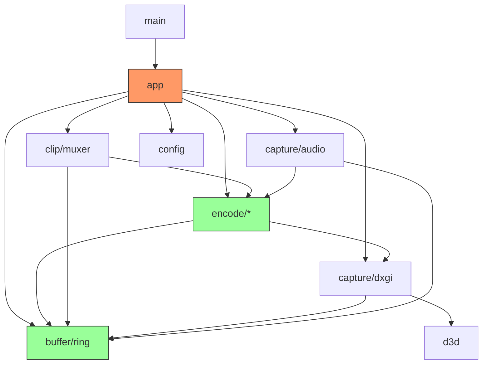

# Architecture Audit Report: LiteClip Replay

## Executive Summary

This report presents a comprehensive architectural audit of the LiteClip Replay codebase. The project is a Windows-only screen capture application using D3D11/DXGI Desktop Duplication with FFmpeg-based hardware encoding (NVENC/AMF/QSV) and a memory-bounded ring buffer for replay functionality.

**Overall Assessment:** The codebase demonstrates good separation of concerns with split module organization, but has several critical architectural issues:

1. **High Severity (5 issues):** Memory bottlenecks, race conditions, and architectural anti-patterns
2. **Medium Severity (8 issues):** Tight coupling, leaky abstractions, and design violations
3. **Low Severity (7 issues):** Code organization and maintainability concerns

---

## 1. Architectural Patterns

### 1.1 Pattern Evaluation

The project follows a **Producer-Consumer Pipeline** pattern with mixed architectural influences:

| File | Issue | Severity |
|------|-------|----------|
| `src/app.rs:31-48` | Inconsistent abstraction levels - `should_use_hardware_pull_mode` directly checks encoder availability instead of delegating to encoder module | Medium |
| `src/encode/mod.rs:10-11` | Wildcard re-exports obscure actual module dependencies | Low |
| `src/capture/mod.rs:66-76` | Trait-based CaptureBackend interface, but implementation tightly coupled to DxgiCapture | Low |
| `src/buffer/mod.rs:6` | Module re-exports don't follow consistent pattern | Low |

**Pattern Analysis:**
- **Good:** Split module structure using `splitrs` pattern separates types, functions, and traits
- **Bad:** No clear architectural boundaries between capture, encode, and buffer modules
- **Mixed:** Async/sync boundary handling varies across the codebase

### 1.2 Leaky Abstractions

| File | Issue | Severity |
|------|-------|----------|
| `src/capture/mod.rs:42-52` | CapturedFrame exposes both GPU texture handle AND CPU BGRA bytes - Phase 1 limitation causing memory overhead | High |
| `src/encode/hw_encoder/types.rs:20-38` | HardwareEncoderBase exposes internal FFmpeg process handles | Medium |
| `src/buffer/ring/types.rs:237-283` | SharedReplayBuffer leaks internal RwLock implementation details | Low |
| `src/capture/dxgi/types.rs:32-51` | DxgiCapture exposes internal thread handles and senders | Low |

**Critical Finding:**
The `CapturedFrame` struct at `src/capture/mod.rs:42-52` violates abstraction by containing both:
```rust
pub struct CapturedFrame {
    pub texture: D3D11Texture,  // GPU handle
    pub bgra: Bytes,            // CPU readback data (unnecessary for hardware encoding)
    // ...
}
```
This causes unnecessary CPU readback even when using hardware encoders that could consume GPU textures directly.

---

## 2. Logic & Flow

### 2.1 Complex Branching

| File | Issue | Severity |
|------|-------|----------|
| `src/app.rs:75-181` | Nested mode selection (hardware pull vs CPU capture) with duplicated audio setup code | Medium |
| `src/encode/hw_encoder/types.rs:66-191` | FFmpeg command building has complex conditional branching per encoder type | Medium |
| `src/clip/muxer/types.rs:122-148` | Finalize method has complex conditional paths for H.264 vs MJPEG | Low |
| `src/capture/dxgi/types.rs:326-405` | Capture loop has deeply nested error handling with reinitialization logic | Low |

**Code Duplication:**
`src/app.rs:75-181` contains two nearly identical audio capture setup blocks (lines 81-110 and 119-152), violating DRY principles.

### 2.2 Race Conditions

| File | Issue | Severity |
|------|-------|----------|
| `src/buffer/ring/types.rs:66-110` | Non-atomic eviction logic - packets_to_evict calculation and eviction are separate operations | **High** |
| `src/encode/hw_encoder/types.rs:339-441` | spawn_output_reader accesses shared frame metadata without synchronization | **High** |
| `src/encode/encoder_mod/functions.rs:138-209` | Encoder thread may lose packets between flush and final drain | Medium |
| `src/capture/audio/manager.rs:140-219` | Forward loop races on channel disconnection detection | Medium |
| `src/app.rs:205-217` | Thread join without checking if encoder already finished | Low |

**Critical Race Condition:**
`ReplayBuffer::push()` at `src/buffer/ring/types.rs:66-110` has a TOCTOU vulnerability:
```rust
// Line 70-81: Calculates packets to evict
while !self.packets.is_empty() {
    let oldest_pts = self.packets.front().map(|p| p.pts).unwrap_or(packet.pts);
    // ... calculation
}
// Line 82-87: Evicts packets in separate loop
for _ in 0..packets_to_evict {
    self.evict_oldest();
}
```
Between calculation and eviction, new packets could be added, causing incorrect eviction behavior.

---

## 3. Dependency Analysis

### 3.1 Tight Coupling

| File | Issue | Severity |
|------|-------|----------|
| `src/app.rs:5-18` | AppState directly depends on 9 internal modules - violates facade pattern | **High** |
| `src/encode/encoder_mod/functions.rs:1-10` | Encoder module directly imports from sw_encoder and hw_encoder | Medium |
| `src/clip/muxer/types.rs:1-15` | Muxer depends on buffer::ring::qpc_frequency - cross-module internal dependency | Medium |
| `src/capture/audio/mic.rs:22-23` | Direct dependency on buffer module from capture | Low |

**Coupling Analysis:**
```
AppState (app.rs)
├── buffer::ring::SharedReplayBuffer
├── capture::audio::WasapiAudioManager
├── capture::dxgi::DxgiCapture
├── clip::spawn_clip_saver
├── encode::spawn_encoder
└── config::Config
```
The central AppState acts as a "god object" with direct dependencies across all major subsystems.

### 3.2 Circular Dependencies

| File | Issue | Severity |
|------|-------|----------|
| `src/encode/hw_encoder/types.rs:1-18` | Circular: hw_encoder/types.rs → buffer/ring/functions.rs (qpc_frequency) → encode types | Low |
| `src/encode/encoder_mod/types.rs:1-166` | EncodedPacket resolution field depends on capture types | Low |

No critical circular dependencies detected. The dependency graph is mostly hierarchical with some utility function cross-references.

---

## 4. Scalability & Bottlenecks

### 4.1 Performance Issues

| File | Issue | Severity |
|------|-------|----------|
| `src/buffer/ring/types.rs:131-142` | O(N) keyframe index rebuilding on every eviction - will stall under memory pressure | **High** |
| `src/capture/dxgi/types.rs:247-303` | Synchronous CPU readback blocks capture thread | **High** |
| `src/encode/sw_encoder.rs:264-301` | JPEG encoding workers use blocking recv - thread pool underutilized on frame drops | Medium |
| `src/clip/muxer/types.rs:609-640` | Synchronous FFmpeg stdin write for MJPEG path | Medium |

**Critical Performance Bottleneck:**
Keyframe index management at `src/buffer/ring/types.rs:131-142`:
```rust
pub fn snapshot_from(&self, start_pts: i64) -> Result<Vec<EncodedPacket>> {
    let start_index = self
        .keyframe_index
        .range(..=start_pts)  // O(log N) lookup
        .last()
        .map(|(_, &abs_idx)| abs_idx.saturating_sub(self.base_offset))
        .unwrap_or(0);
    // O(N) iteration with skip
    result.extend(self.packets.iter().skip(start_index).cloned());
}
```
While individual operations are efficient, the overall eviction pattern causes O(N) behavior.

### 4.2 Resource Management

| File | Issue | Severity |
|------|-------|----------|
| `src/encode/hw_encoder/types.rs:26-35` | Multiple optional fields for thread/process handles without unified cleanup | Medium |
| `src/capture/dxgi/types.rs:54-59` | Capture thread handle stored as Option without structured lifecycle | Low |
| `src/app.rs:297-317` | Drop implementation duplicates stop_recording logic | Low |

**Resource Leak Risk:**
`HardwareEncoderBase` at `src/encode/hw_encoder/types.rs:20-38` stores multiple optional handles:
```rust
pub struct HardwareEncoderBase {
    pub(super) ffmpeg_process: Option<std::process::Child>,
    pub(super) ffmpeg_stdin: Option<ChildStdin>,
    pub(super) stdout_thread: Option<thread::JoinHandle<()>>,
    pub(super) stderr_thread: Option<thread::JoinHandle<()>>,
    // ...
}
```
Each requires separate cleanup; missing any can cause resource leaks.

---

## 5. SOLID Principles Violations

### 5.1 Single Responsibility

| File | Issue | Severity |
|------|-------|----------|
| `src/app.rs:20-295` | AppState handles recording, encoding, capture, audio, and hotkeys | **High** |
| `src/encode/hw_encoder/types.rs:20-602` | HardwareEncoderBase handles FFmpeg process management, encoding, and output parsing | **High** |
| `src/clip/muxer/types.rs:18-766` | Muxer handles both H.264 and MJPEG paths with different strategies | Medium |
| `src/capture/audio/mixer.rs:38-266` | AudioMixer handles both mixing and packet forwarding | Low |

**Violation:**
`AppState` violates Single Responsibility Principle by acting as a central coordinator for:
- Recording lifecycle management
- Hardware encoder selection
- Audio capture initialization
- Clip saving orchestration
- Configuration access

### 5.2 Interface Segregation

| File | Issue | Severity |
|------|-------|----------|
| `src/encode/encoder_mod/functions.rs:16-27` | Encoder trait requires all methods even for simple implementations | Medium |
| `src/capture/mod.rs:66-91` | CaptureBackend trait mixes frame capture with lifecycle management | Low |

**Trait Design Issues:**
```rust
pub trait Encoder: Send + 'static {
    fn init(&mut self, config: &EncoderConfig) -> Result<()>;
    fn encode_frame(&mut self, frame: &CapturedFrame) -> Result<()>;
    fn flush(&mut self) -> Result<Vec<EncodedPacket>>;
    fn packet_rx(&self) -> Receiver<EncodedPacket>;
    fn is_running(&self) -> bool;
}
```
The `Encoder` trait could be split into `EncoderConfig`, `FrameProcessor`, and `PacketProducer` traits.

### 5.3 Dependency Inversion

| File | Issue | Severity |
|------|-------|----------|
| `src/app.rs:31-48` | AppState directly references encoder types instead of using trait | Medium |
| `src/encode/encoder_mod/functions.rs:65-131` | create_encoder returns Box<dyn Encoder> but has hardcoded fallback logic | Low |

---

## High Severity Refactors

### Issue 1: CPU Readback for Hardware Encoding

**Current Problem:**
`CapturedFrame` at `src/capture/mod.rs:42-52` always includes CPU BGRA data even when using hardware encoders that support GPU-direct encoding. This causes:
1. Unnecessary memory copies (14MB+ per 1080p frame)
2. PCIe bandwidth waste
3. Higher latency

**Proposed Refactor:**
```rust
// capture/mod.rs
pub enum FrameData {
    GpuOnly(D3D11Texture),
    CpuReadback(Bytes),  // For software encoders
    Hybrid {             // When both needed
        texture: D3D11Texture,
        bgra: Bytes,
    }
}

pub struct CapturedFrame {
    pub data: FrameData,
    pub timestamp: i64,
    pub resolution: (u32, u32),
}

// Hardware encoders implement:
trait GpuEncoder {
    fn encode_gpu_frame(&mut self, texture: &D3D11Texture) -> Result<()>;
}
```

### Issue 2: Ring Buffer Keyframe Index Performance

**Current Problem:**
`ReplayBuffer` at `src/buffer/ring/types.rs:66-120` rebuilds keyframe indices O(N) during eviction. Under memory pressure with high frame rates, this causes frame drops.

**Proposed Refactor:**
```rust
// Use a more efficient index structure
pub struct ReplayBuffer {
    packets: VecDeque<EncodedPacket>,
    // Use VecDeque for O(1) front/back operations
    keyframe_deque: VecDeque<(i64, usize)>, // (pts, relative_index)
    base_offset: usize,
    // ...
}

impl ReplayBuffer {
    fn evict_oldest(&mut self) {
        if let Some(packet) = self.packets.pop_front() {
            self.total_bytes -= packet.data.len();
            // O(1) front removal
            if let Some(&(pts, _)) = self.keyframe_deque.front() {
                if pts == packet.pts {
                    self.keyframe_deque.pop_front();
                }
            }
            self.base_offset += 1;
        }
    }
}
```

### Issue 3: AppState God Object

**Current Problem:**
`AppState` at `src/app.rs:20-295` violates SRP by managing all subsystems directly.

**Proposed Refactor:**
```rust
// app.rs - Simplified coordinator
pub struct AppState {
    config: Config,
    pipeline: RecordingPipeline,  // Encapsulates capture+encoding
    clip_manager: ClipManager,    // Encapsulates saving
    hotkey_handler: HotkeyHandler, // Encapsulates platform events
}

// recording/pipeline.rs
pub struct RecordingPipeline {
    capture: Box<dyn CaptureBackend>,
    encoder: Box<dyn Encoder>,
    audio: Option<AudioPipeline>,
    buffer: SharedReplayBuffer,
}

impl RecordingPipeline {
    pub fn start(&mut self) -> Result<()> {
        // Coordinated start with proper dependency ordering
    }
    
    pub fn stop(&mut self) -> Result<()> {
        // Coordinated stop with proper cleanup
    }
}
```

### Issue 4: FFmpeg Process Lifecycle Management

**Current Problem:**
`HardwareEncoderBase` at `src/encode/hw_encoder/types.rs:20-38` manages FFmpeg process with multiple optional fields, risking resource leaks.

**Proposed Refactor:**
```rust
// encode/ffmpeg/process.rs
pub struct ManagedFfmpegProcess {
    child: std::process::Child,
    stdin: ChildStdin,
    stdout_reader: thread::JoinHandle<()>,
    stderr_reader: thread::JoinHandle<()>,
}

impl ManagedFfmpegProcess {
    pub fn spawn(command: Command) -> Result<Self> { /* ... */ }
    
    pub fn shutdown(mut self, timeout: Duration) -> Result<()> {
        // Guaranteed cleanup in correct order
        drop(self.stdin);
        self.wait_or_kill(timeout)?;
        self.join_readers(timeout)?;
    }
}

impl Drop for ManagedFfmpegProcess {
    fn drop(&mut self) {
        // Last-resort cleanup with logging
        if self.child.try_wait().is_err() {
            warn!("FFmpeg process leaked - calling kill");
            let _ = self.child.kill();
        }
    }
}
```

### Issue 5: Ring Buffer Eviction Race Condition

**Current Problem:**
`ReplayBuffer::push()` at `src/buffer/ring/types.rs:66-110` calculates eviction count separately from execution.

**Proposed Refactor:**
```rust
impl ReplayBuffer {
    pub fn push(&mut self, packet: EncodedPacket) {
        let packet_size = packet.data.len();
        let target_duration_qpc = self.duration_to_qpc();
        
        // Atomic eviction decision and execution
        self.evict_to_duration(target_duration_qpc);
        self.evict_to_memory_limit(packet_size);
        
        // Now safe to add
        if packet.is_keyframe {
            let abs_index = self.base_offset + self.packets.len();
            self.keyframe_index.insert(packet.pts, abs_index);
        }
        self.total_bytes += packet_size;
        self.packets.push_back(packet);
    }
    
    fn evict_to_duration(&mut self, target_qpc: i64) {
        while let Some(front) = self.packets.front() {
            if self.newest_pts - front.pts <= target_qpc {
                break;
            }
            self.evict_oldest();
        }
    }
    
    fn evict_to_memory_limit(&mut self, needed: usize) {
        while self.total_bytes + needed > self.max_memory_bytes 
              && !self.packets.is_empty() {
            self.evict_oldest();
        }
    }
}
```

---

## Recommendations Summary

### Immediate Actions (Before Next Release)

1. **Fix Ring Buffer Eviction Race** (`src/buffer/ring/types.rs:66-110`)
   - Combine calculation and eviction into atomic operations
   - Add stress tests with concurrent push/evict scenarios

2. **Add FFmpeg Process Cleanup** (`src/encode/hw_encoder/types.rs:491-561`)
   - Implement structured resource management
   - Add timeout-based forced cleanup

3. **Review Error Handling** (`src/app.rs:205-217`)
   - Ensure thread join results are checked and propagated
   - Add health check mechanism for encoder threads

### Short-term Improvements (Next 2 Sprints)

4. **Refactor AppState** (`src/app.rs:20-295`)
   - Extract RecordingPipeline, ClipManager, and HotkeyHandler
   - Reduce direct module dependencies from 9 to 3

5. **Optimize Keyframe Index** (`src/buffer/ring/types.rs:131-142`)
   - Replace BTreeMap with VecDeque for O(1) eviction
   - Benchmark with high-frame-rate scenarios

6. **Abstract Frame Data** (`src/capture/mod.rs:42-52`)
   - Create FrameData enum for GPU-only/CPU-only/Hybrid modes
   - Enable zero-copy path for hardware encoders

### Long-term Architectural Work (Next Quarter)

7. **Implement Dependency Injection**
   - Replace concrete dependencies with trait objects
   - Enable easier testing and encoder swapping

8. **Async/Sync Boundary Redesign**
   - Standardize channel patterns across modules
   - Consider actor-model for stateful components

9. **Add Circuit Breaker Pattern**
   - For encoder health monitoring
   - Automatic fallback between hardware encoders

---

## Appendix: Module Dependency Graph



**Legend:**
- Orange: High coupling risk
- Green: Good separation

---

*Report generated: 2026-02-16*
*Auditor: Architect Mode*
*Scope: Full codebase analysis including all split modules*
