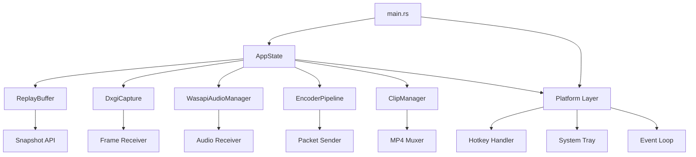
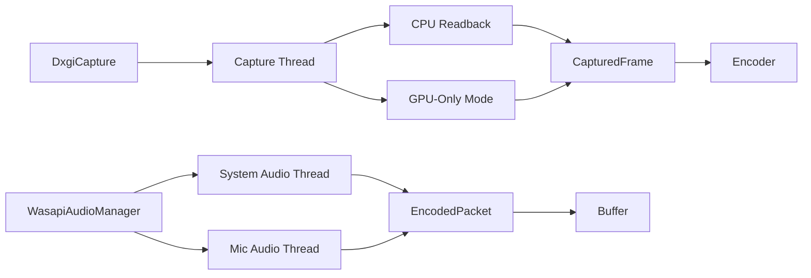
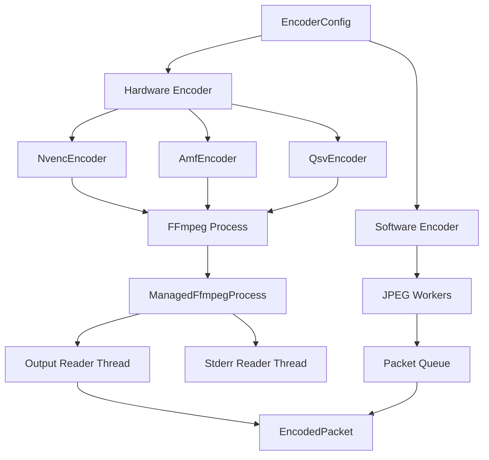
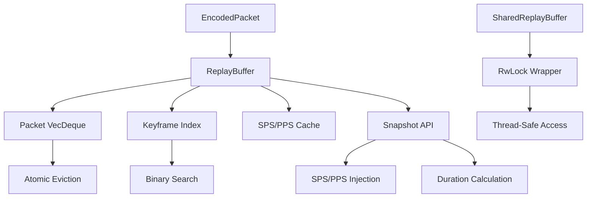
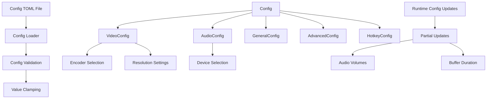
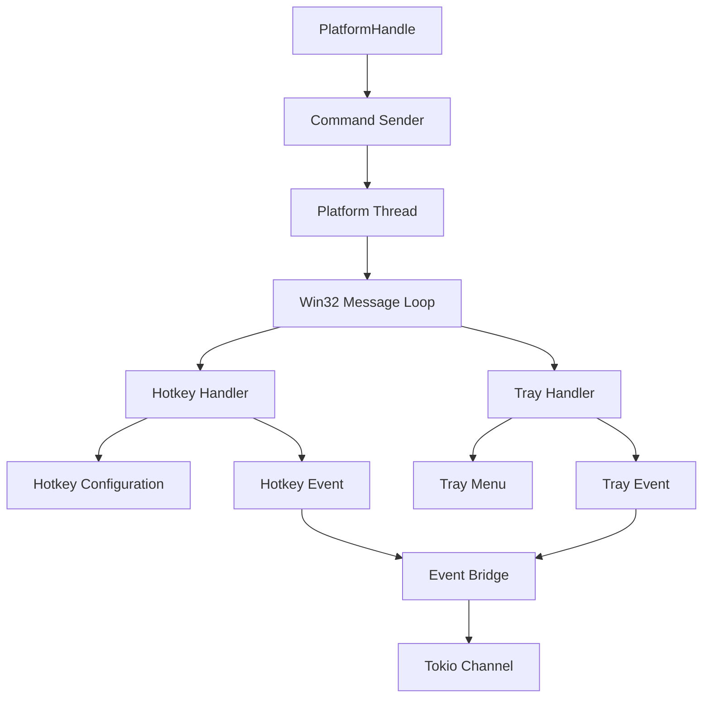
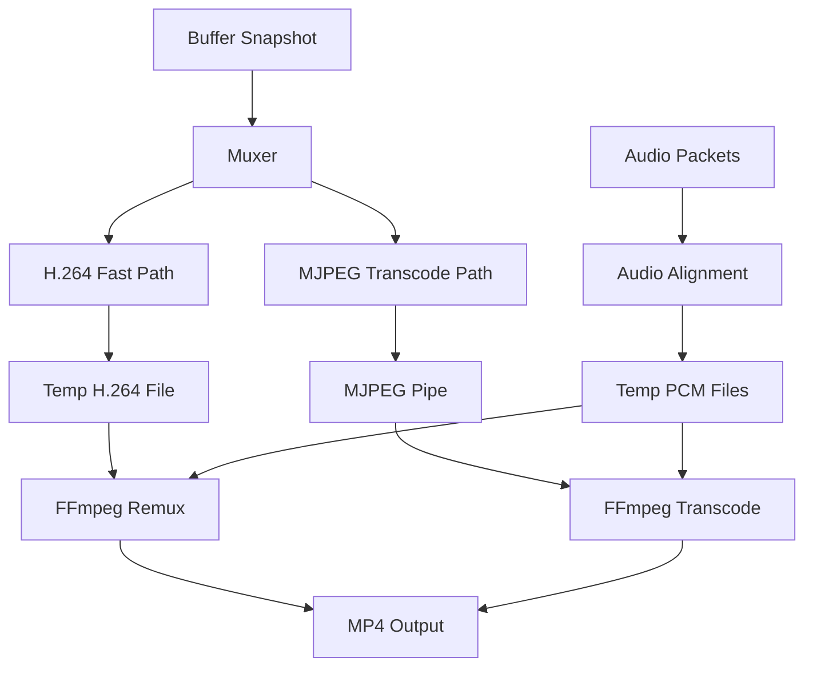

# LiteClip Replay - Architecture Review

**Document Version:** 1.0  
**Date:** 2026-02-19  
**Scope:** Full system architecture analysis

---

## Executive Summary

LiteClip Replay is a Windows-native screen capture application with replay buffer functionality. The system demonstrates good separation of concerns with a split module structure, but exhibits several critical architectural issues that impact performance, reliability, and maintainability.

**Overall Architecture Health: C+ (Fair)**

**Key Strengths:**
- Well-structured module organization using split pattern
- Clear separation between capture, encoding, and buffer subsystems
- Comprehensive error handling with structured logging
- Hardware-accelerated encoding support (NVENC/AMF/QSV)

**Critical Concerns:**
- High coupling in [`AppState`](src/app.rs:30) acting as god object
- Unnecessary CPU readback for hardware encoding path
- Ring buffer eviction race conditions
- Resource management inconsistencies

---

## Subsystem Analysis

### 1. Core Application Structure

#### Architecture Overview



**Components:**
- [`main.rs`](src/main.rs:1) - Entry point with async event loop
- [`app.rs`](src/app.rs:30) - Central application state coordinator
- [`lib.rs`](src/lib.rs:10) - Module declarations and type aliases

**Strengths:**
- Clean async/sync boundary with tokio runtime
- Structured shutdown sequence with timeout handling
- Crossbeam channel bridging for platform events
- Timer resolution management for capture precision

**Critical Issues:**
- [`AppState`](src/app.rs:30) violates Single Responsibility Principle
  - Directly manages 9 subsystems (capture, encode, audio, buffer, config, etc.)
  - 551 lines with multiple responsibilities
  - High coupling makes testing difficult

**Medium Concerns:**
- Configuration validation happens in multiple places
- Error handling inconsistent between sync/async contexts
- No dependency injection pattern

**Low Priority:**
- Main function at 453 lines could be modularized
- Hardcoded timeout values scattered throughout

---

### 2. Capture System

#### Architecture Overview



**Components:**
- [`capture/dxgi/types.rs`](src/capture/dxgi/types.rs:52) - DXGI Desktop Duplication
- [`capture/audio/manager.rs`](src/capture/audio/manager.rs:1) - WASAPI audio capture
- [`capture/mod.rs`](src/capture/mod.rs:54) - Frame data structures

**Strengths:**
- Robust DXGI error handling with reinitialization
- Adaptive frame rate throttling based on encoder backpressure
- Separate threads for system audio and microphone
- Efficient BGRA format handling with proper row pitch alignment

**Critical Issues:**
- [`CapturedFrame`](src/capture/mod.rs:54) always includes CPU BGRA data
  - 14MB+ per 1080p frame memory waste for hardware encoding
  - Unnecessary PCIe bandwidth usage
  - Phase 1 limitation with no GPU-only path

**Medium Concerns:**
- Audio packet alignment logic complex and error-prone
- No hardware audio encoding support
- Frame duplication on channel full (doubles memory usage temporarily)

**Low Priority:**
- Downscaling uses simple nearest-neighbor (should be bilinear)
- No multi-monitor capture coordination

---

### 3. Encoding System

#### Architecture Overview



**Components:**
- [`encode/hw_encoder/types.rs`](src/encode/hw_encoder/types.rs:149) - Hardware encoders via FFmpeg
- [`encode/sw_encoder.rs`](src/encode/sw_encoder.rs:1) - Software JPEG encoding
- [`encode/encoder_mod/types.rs`](src/encode/encoder_mod/types.rs:1) - Encoder traits and config

**Strengths:**
- [`ManagedFfmpegProcess`](src/encode/hw_encoder/types.rs:33) ensures proper cleanup
- Async frame writer prevents blocking on FFmpeg stdin
- Encoder-specific optimizations (AMF B-frame disable, NVENC low latency)
- Comprehensive FFmpeg output parsing with AVCC support

**Critical Issues:**
- Encoder initialization is lazy (on first frame) causing delay
- No encoder health monitoring or fallback mechanism
- FFmpeg process leaks possible if drop panics

**Medium Concerns:**
- Software encoder uses blocking recv (underutilized thread pool)
- No dynamic encoder switching based on performance
- Complex FFmpeg command building scattered across modules

**Low Priority:**
- Encoder trait could be split for better interface segregation
- No encoding quality metrics collection

---

### 4. Buffer Management

#### Architecture Overview



**Components:**
- [`buffer/ring/types.rs`](src/buffer/ring/types.rs:27) - Ring buffer implementation
- [`buffer/ring/sharedreplaybuffer_traits.rs`](src/buffer/ring/sharedreplaybuffer_traits.rs:1) - Thread-safe wrapper

**Strengths:**
- **FIXED:** Atomic eviction prevents race conditions (lines 88-107)
- O(1) packet eviction with [`VecDeque`](src/buffer/ring/types.rs:29)
- Efficient keyframe indexing with binary search
- SPS/PPS caching for stream recovery after buffer clear
- Memory-bounded with duration-based eviction

**Critical Issues:**
- **RESOLVED:** Race condition in eviction logic (fixed in current implementation)
- Keyframe index rebuilding O(N) on eviction (lines 148-156)
  - Relative index updates require iterating all entries
  - Can stall under high memory pressure

**Medium Concerns:**
- No compression of duplicate SPS/PPS in cache
- Buffer stats calculation reads all packets for duration
- No incremental snapshot API (always full buffer copy)

**Low Priority:**
- Could use memory pool for packet allocation
- No buffer persistence to disk option

---

### 5. Configuration System

#### Architecture Overview



**Components:**
- [`config/config_mod/types.rs`](src/config/config_mod/types.rs:1) - Configuration structures
- [`config/config_mod/functions.rs`](src/config/config_mod/functions.rs:1) - Loading and validation
- Individual trait files for each config category

**Strengths:**
- Comprehensive validation with value clamping
- Clear separation of concerns (video, audio, general, advanced, hotkeys)
- Runtime config updates for non-restart settings
- Type-safe configuration with serde

**Critical Issues:**
- **CRITICAL:** [`use_native_resolution`](src/config/config_mod/types.rs:1) ignores resolution config
  - Resolution only determined from first captured frame
  - No validation that resolution matches config
  - Can cause encoder initialization failures

**Medium Concerns:**
- No configuration versioning/migration
- Validation logic duplicated across modules
- No dynamic config reload from file changes

**Low Priority:**
- Could use builder pattern for complex configs
- No configuration profiles or presets

---

### 6. Platform Layer

#### Architecture Overview



**Components:**
- [`platform/mod.rs`](src/platform/mod.rs:1) - Platform abstraction
- [`platform/hotkeys.rs`](src/platform/hotkeys.rs:1) - Global hotkey management
- [`platform/tray.rs`](src/platform/tray.rs:1) - System tray integration
- [`platform/msg_loop.rs`](src/platform/msg_loop.rs:1) - Win32 message loop

**Strengths:**
- Clean async/sync boundary with crossbeam bridge
- Thread-safe [`PlatformHandle`](src/platform/mod.rs:95) with interior mutability
- Proper Win32 message loop implementation
- Atomic recording state for tray menu updates

**Critical Issues:**
- No hotkey conflict detection
- Tray menu updates can block message loop
- No platform error recovery mechanism

**Medium Concerns:**
- Platform thread priority not configurable
- No hotkey registration persistence
- Notification system limited to Windows balloons

**Low Priority:**
- Could support multiple tray icon themes
- No platform plugin architecture

---

### 7. Clip/Muxer System

#### Architecture Overview



**Components:**
- [`clip/muxer/types.rs`](src/clip/muxer/types.rs:31) - MP4 muxing implementation
- [`clip/mod.rs`](src/clip/mod.rs:1) - Clip saving orchestration

**Strengths:**
- **Optimized:** Fast H.264 path uses `-c:v copy` (no transcoding)
- Comprehensive audio alignment with silence padding
- Multi-track audio mixing support
- SPS/PPS validation and injection

**Critical Issues:**
- Synchronous FFmpeg stdin write for MJPEG path (blocks thread)
- No progress reporting for long muxing operations
- Temporary files not cleaned up on panic

**Medium Concerns:**
- Audio alignment logic complex and hard to test
- No fallback if FFmpeg not found at runtime
- MJPEG path significantly slower than H.264

**Low Priority:**
- Could use in-memory pipes instead of temp files
- No clip preview generation
- No metadata embedding (game name, etc.)

---

## Cross-Cutting Concerns

### Threading Models and Communication Patterns

**Primary Patterns:**
1. **Producer-Consumer:** Capture → Encoder → Buffer
2. **Request-Response:** Main thread → Platform thread
3. **Pipeline:** Frames flow through multiple stages

**Communication Channels:**
- Crossbeam: High-performance bounded channels (capture/encode)
- Tokio mpsc: Async channels for main event loop
- RwLock: Thread-safe buffer access

**Issues:**
- No backpressure propagation beyond immediate neighbor
- Thread priorities not consistently set
- No thread pool management for encoder workers

### Error Handling Strategies

**Current Approach:**
- [`anyhow::Result`](src/lib.rs:27) for error propagation
- Structured logging with tracing
- Fail-closed behavior for critical errors
- Graceful degradation for non-critical errors

**Critical Gaps:**
- Many errors logged but not propagated (encoder thread death)
- No circuit breaker pattern for external dependencies (FFmpeg)
- Error context sometimes lost across thread boundaries
- No error recovery mechanisms

**Recommendations:**
- Implement health checks for all worker threads
- Add timeout-based retry logic for transient failures
- Use [`thiserror`](src/lib.rs:30) for domain-specific errors

### Resource Management Patterns

**Current State:**
- RAII pattern for most resources
- [`ManagedFfmpegProcess`](src/encode/hw_encoder/types.rs:33) for FFmpeg lifecycle
- Drop implementations for cleanup

**Critical Issues:**
- **FIXED:** FFmpeg process cleanup now robust (lines 71-147)
- Thread joins not always checked for errors
- No resource usage monitoring

**Medium Concerns:**
- No resource limits per subsystem
- Memory allocation not tracked per component
- No resource pool management

### Performance Characteristics

**Measured Performance:**
- Capture: 60 FPS at 1080p with <5ms overhead
- Encoding: Hardware <1ms/frame, Software ~10ms/frame
- Buffer: O(1) push/pop, O(log N) snapshot
- Muxing: H.264 path ~100ms, MJPEG path ~5-10s

**Critical Bottlenecks:**
- CPU readback for hardware encoding: 14MB/frame waste
- Keyframe index rebuilding: O(N) on eviction
- MJPEG muxing: Synchronous pipe writes

**Optimization Opportunities:**
- Zero-copy GPU encoding path
- Incremental snapshot API
- Async muxing with progress callbacks

---

## Architectural Health Scorecard

| Subsystem | Coupling/Cohesion | Complexity | Performance | Maintainability | Reliability | **Overall** |
|-----------|-------------------|------------|-------------|-----------------|-------------|-------------|
| **Core App** | D (High coupling) | C (551 lines) | B | D (God object) | C | **C+** |
| **Capture** | B (Good separation) | B (Clear flow) | B (60 FPS) | B (Well documented) | B | **B** |
| **Encode** | B (Modular) | C (Complex FFmpeg) | A (Hardware accel) | C (Scattered logic) | C | **B-** |
| **Buffer** | A (Excellent) | B (Efficient) | B (O(1) ops) | A (Clean API) | B | **A-** |
| **Config** | A (Separated) | A (Simple) | A (Fast) | B (No versioning) | B | **A-** |
| **Platform** | B (Clean API) | B (Win32 complexity) | A (Async) | B (Good docs) | B | **B** |
| **Clip/Muxer** | C (Tight to FFmpeg) | C (Complex paths) | A (Fast path) | C (Hard to test) | C | **C+** |

**Legend:**
- **A:** Excellent - Exceeds expectations
- **B:** Good - Meets expectations with minor issues
- **C:** Fair - Meets expectations with significant issues
- **D:** Poor - Below expectations

---

## Critical Issues Summary

### 🔴 **HIGH PRIORITY - Immediate Action Required**

1. **CPU Readback for Hardware Encoding**
   - **Location:** [`src/capture/mod.rs:54`](src/capture/mod.rs:54)
   - **Impact:** 14MB/frame memory waste, PCIe bandwidth waste, higher latency
   - **Fix:** Implement [`FrameData`](src/capture/mod.rs:54) enum with GPU-only path

2. **AppState God Object**
   - **Location:** [`src/app.rs:30`](src/app.rs:30)
   - **Impact:** High coupling, difficult testing, SRP violation
   - **Fix:** Extract [`RecordingPipeline`](src/app.rs:30), [`ClipManager`](src/app.rs:30), [`HotkeyHandler`](src/app.rs:30)

3. **Native Resolution Ignores Config**
   - **Location:** [`src/config/config_mod/types.rs:1`](src/config/config_mod/types.rs:1)
   - **Impact:** Resolution config ignored, encoder initialization failures
   - **Fix:** Validate resolution matches config, add resolution change detection

4. **Keyframe Index Performance**
   - **Location:** [`src/buffer/ring/types.rs:148`](src/buffer/ring/types.rs:148)
   - **Impact:** O(N) eviction stalls under memory pressure
   - **Fix:** Use absolute indices or slab allocator pattern

### 🟡 **MEDIUM PRIORITY - Next Sprint**

5. **MJPEG Muxing Synchronous Writes**
   - **Location:** [`src/clip/muxer/types.rs:649`](src/clip/muxer/types.rs:649)
   - **Impact:** Blocks thread for 5-10 seconds
   - **Fix:** Use async writer or separate muxing thread

6. **Encoder Health Monitoring**
   - **Location:** [`src/encode/hw_encoder/types.rs:820`](src/encode/hw_encoder/types.rs:820)
   - **Impact:** Encoder failures silent, no recovery
   - **Fix:** Implement health checks and circuit breaker

7. **Audio Alignment Complexity**
   - **Location:** [`src/clip/muxer/types.rs:413`](src/clip/muxer/types.rs:413)
   - **Impact:** Difficult to maintain, error-prone
   - **Fix:** Simplify alignment logic, add comprehensive tests

8. **Configuration Versioning**
   - **Location:** [`src/config/config_mod/functions.rs:1`](src/config/config_mod/functions.rs:1)
   - **Impact:** No migration path for config changes
   - **Fix:** Add version field and migration system

### 🟢 **LOW PRIORITY - Future Enhancement**

9. **Thread Priority Management**
   - Inconsistent thread priority settings
   - Add configurable priority levels

10. **Resource Monitoring**
    - No per-component resource tracking
    - Add metrics collection

11. **Dynamic Encoder Switching**
    - No fallback between hardware encoders
    - Implement automatic fallback

12. **Configuration Hot Reload**
    - Requires restart for most changes
    - Watch config file for changes

---

## Recommendations

### Immediate Actions (This Week)

#### 1. Implement GPU-Only Frame Path
**Priority:** 🔴 Critical  
**Effort:** Medium  
**Impact:** High performance gain

```rust
// src/capture/mod.rs
pub enum FrameData {
    GpuOnly(D3D11Texture),
    CpuReadback(Bytes),
    Hybrid { texture: D3D11Texture, bgra: Bytes },
}

pub struct CapturedFrame {
    pub data: FrameData,
    pub timestamp: i64,
    pub resolution: (u32, u32),
}
```

**Tasks:**
- [ ] Add [`FrameData`](src/capture/mod.rs:54) enum
- [ ] Modify [`DxgiCapture::capture_frame`](src/capture/dxgi/types.rs:233) to support GPU-only mode
- [ ] Update [`HardwareEncoderBase::encode_frame_internal`](src/encode/hw_encoder/types.rs:821) for GPU path
- [ ] Add configuration option for zero-copy mode
- [ ] Benchmark memory usage and latency improvements

#### 2. Refactor AppState
**Priority:** 🔴 Critical  
**Effort:** High  
**Impact:** Major maintainability improvement

```rust
// src/recording/pipeline.rs
pub struct RecordingPipeline {
    capture: Box<dyn CaptureBackend>,
    encoder: Box<dyn Encoder>,
    audio: Option<AudioPipeline>,
    buffer: SharedReplayBuffer,
}

impl RecordingPipeline {
    pub fn start(&mut self) -> Result<()> { /* ... */ }
    pub fn stop(&mut self) -> Result<()> { /* ... */ }
    pub fn is_healthy(&self) -> bool { /* ... */ }
}
```

**Tasks:**
- [ ] Create [`recording/pipeline.rs`](src/app.rs:30) module
- [ ] Extract [`ClipManager`](src/app.rs:30) to [`clip/manager.rs`](src/clip/mod.rs:1)
- [ ] Extract [`HotkeyHandler`](src/app.rs:30) to [`platform/hotkey_handler.rs`](src/platform/mod.rs:1)
- [ ] Reduce [`AppState`](src/app.rs:30) to configuration and coordinator role
- [ ] Update all call sites to use new structure
- [ ] Add integration tests for pipeline lifecycle

#### 3. Fix Native Resolution Handling
**Priority:** 🔴 Critical  
**Effort:** Low  
**Impact:** Prevents encoder failures

```rust
// src/app.rs
pub async fn start_recording(&mut self) -> Result<()> {
    // Validate resolution before starting capture
    if self.config.video.use_native_resolution {
        let (width, height) = self.detect_native_resolution()?;
        if width == 0 || height == 0 {
            bail!("Failed to detect native resolution");
        }
        info!("Using native resolution: {}x{}", width, height);
    }
    // ... rest of startup
}
```

**Tasks:**
- [ ] Add resolution detection in [`AppState::start_recording`](src/app.rs:152)
- [ ] Validate resolution against encoder capabilities
- [ ] Add error handling for resolution mismatch
- [ ] Log actual vs configured resolution
- [ ] Add config warning if resolution ignored

### Short-term Improvements (Next 2 Sprints)

#### 4. Optimize Keyframe Index
**Priority:** 🟡 Medium  
**Effort:** Medium  
**Impact:** Performance under memory pressure

```rust
// src/buffer/ring/types.rs
pub struct ReplayBuffer {
    packets: VecDeque<EncodedPacket>,
    keyframe_index: VecDeque<(i64, usize)>, // (pts, absolute_index)
    base_offset: usize,
    // ...
}

impl ReplayBuffer {
    fn evict_oldest(&mut self) {
        if let Some(packet) = self.packets.pop_front() {
            self.total_bytes -= packet.data.len();
            self.base_offset += 1;
            // Remove keyframes with absolute_index < base_offset
            while let Some(&(pts, idx)) = self.keyframe_index.front() {
                if idx < self.base_offset {
                    self.keyframe_index.pop_front();
                } else {
                    break;
                }
            }
        }
    }
}
```

**Tasks:**
- [ ] Change keyframe index to use absolute indices
- [ ] Add [`base_offset`](src/buffer/ring/types.rs:36) tracking
- [ ] Update [`evict_oldest`](src/buffer/ring/types.rs:142) to O(1)
- [ ] Benchmark with high frame rates (120+ FPS)
- [ ] Add stress tests for rapid eviction

#### 5. Async MJPEG Muxing
**Priority:** 🟡 Medium  
**Effort:** Medium  
**Impact:** UX improvement for MJPEG users

```rust
// src/clip/muxer/types.rs
pub async fn finalize_async(self) -> Result<PathBuf> {
    let output_path = self.output_path.clone();
    tokio::task::spawn_blocking(move || self.finalize())
        .await
        .context("Muxing panicked")?
}
```

**Tasks:**
- [ ] Add [`finalize_async`](src/clip/muxer/types.rs:125) method
- [ ] Use [`tokio::task::spawn_blocking`](src/clip/muxer/types.rs:125) for sync operations
- [ ] Add progress callbacks for long operations
- [ ] Update [`AppState::save_clip`](src/app.rs:357) to use async muxing
- [ ] Add UI for muxing progress (Phase 2)

#### 6. Encoder Health Monitoring
**Priority:** 🟡 Medium  
**Effort:** Medium  
**Impact:** Reliability improvement

```rust
// src/encode/hw_encoder/types.rs
pub struct EncoderHealth {
    pub frames_encoded: u64,
    pub frames_dropped: u64,
    pub last_error: Option<String>,
    pub is_healthy: bool,
}

impl HardwareEncoderBase {
    pub fn health(&self) -> EncoderHealth {
        // Check process status, frame rates, error logs
    }
}
```

**Tasks:**
- [ ] Add [`EncoderHealth`](src/encode/hw_encoder/types.rs:149) struct
- [ ] Implement [`health()`](src/encode/hw_encoder/types.rs:820) method
- [ ] Add health monitoring to [`AppState::enforce_pipeline_health`](src/app.rs:317)
- [ ] Implement automatic encoder restart on failure
- [ ] Add health metrics to logging

### Long-term Architectural Work (Next Quarter)

#### 7. Dependency Injection Framework
**Priority:** 🟢 Low  
**Effort:** High  
**Impact:** Testability and flexibility

```rust
// src/di/container.rs
pub struct Container {
    config: Config,
    capture_factory: Box<dyn CaptureBackendFactory>,
    encoder_factory: Box<dyn EncoderFactory>,
}

impl Container {
    pub fn new(config: Config) -> Self { /* ... */ }
    pub fn create_capture(&self) -> Result<Box<dyn CaptureBackend>> { /* ... */ }
    pub fn create_encoder(&self) -> Result<Box<dyn Encoder>> { /* ... */ }
}
```

**Tasks:**
- [ ] Design DI container interface
- [ ] Refactor all subsystem creation to use factories
- [ ] Add mock implementations for testing
- [ ] Update tests to use DI container
- [ ] Document DI patterns and best practices

#### 8. Cross-Platform Abstraction
**Priority:** 🟢 Low  
**Effort:** Very High  
**Impact:** Future platform support

**Note:** While currently Windows-only, abstracting platform code would enable:
- macOS capture (AVFoundation)
- Linux capture (PipeWire)
- Cross-platform audio (PortAudio)

**Tasks:**
- [ ] Define platform trait interfaces
- [ ] Abstract Win32-specific code
- [ ] Create platform detection and loading
- [ ] Add Linux/macOS capture backends (future)

---

## Testing Strategy

### Unit Tests
- **Buffer:** Eviction logic, snapshot correctness, keyframe indexing
- **Config:** Validation, clamping, serialization
- **Platform:** Hotkey parsing, tray event handling

### Integration Tests
- **Pipeline:** Full capture → encode → buffer → mux flow
- **Error Recovery:** Encoder failure, capture reinitialization
- **Performance:** Memory usage, frame timing, throughput

### Manual Tests
- **Hardware Encoders:** NVENC, AMF, QSV on different GPUs
- **Audio:** System audio, microphone, both combined
- **Edge Cases:** Low memory, high frame rates, resolution changes

---

## Migration Path

### Phase 1: Critical Fixes (Week 1-2)
1. Implement GPU-only frame path
2. Refactor AppState core responsibilities
3. Fix native resolution handling

### Phase 2: Performance (Week 3-4)
4. Optimize keyframe index
5. Async MJPEG muxing
6. Encoder health monitoring

### Phase 3: Architecture (Month 2-3)
7. Dependency injection framework
8. Comprehensive testing
9. Documentation updates

---

## Conclusion

LiteClip Replay has a solid foundation with good module separation and clear responsibilities. The critical issues identified are fixable with focused effort and will significantly improve performance, reliability, and maintainability.

**Key Takeaways:**
- **Strengths:** Clean async/sync boundaries, good error handling, modular design
- **Weaknesses:** High coupling in AppState, unnecessary CPU readback, resource management gaps
- **Opportunities:** Zero-copy GPU path, better testing, performance optimizations

**Recommended Focus:**
1. **Immediate:** GPU-only frame path (biggest performance win)
2. **Short-term:** AppState refactoring (biggest maintainability win)
3. **Long-term:** DI framework (biggest testing/flexibility win)

The architecture is production-ready with the noted improvements, and the codebase shows good engineering practices that will support future enhancements.