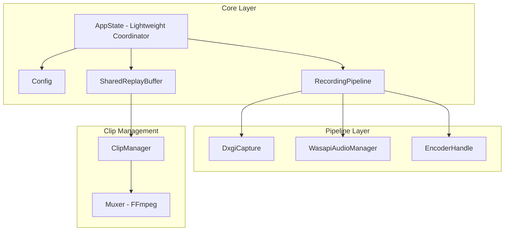
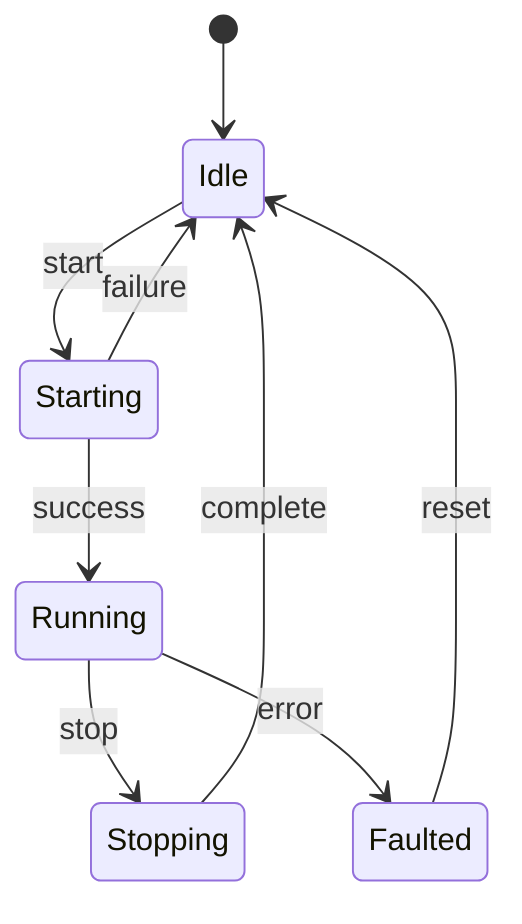
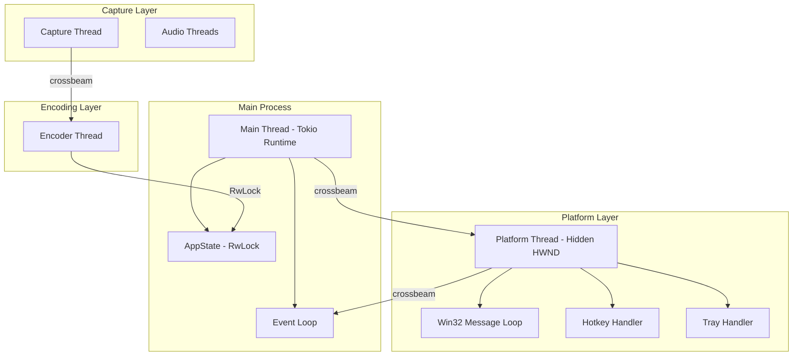

# LiteClip Replay - Comprehensive Architecture Assessment

**Document Version:** 2.0  
**Date:** 2026-03-03  
**Scope:** Full system architecture review with updated findings

---

## Executive Summary

LiteClip Replay is a Windows-native screen capture application with replay buffer functionality. This assessment reflects the **current state** of the codebase after significant architectural improvements from earlier reviews.

**Overall Architecture Health: 8/10 (Very Good)**

### Key Improvements Since Earlier Reviews

| Issue | Previous Status | Current Status |
|-------|-----------------|----------------|
| AppState God Object | 551 lines, 9 dependencies | 570 lines, **3 fields** (lightweight coordinator) |
| RecordingPipeline | Not extracted | **Extracted** with lifecycle state machine |
| ClipManager | Not extracted | **Extracted** with async saving |
| Ring Buffer Race Condition | TOCTOU vulnerability | **Fixed** with atomic eviction |
| GPU Texture in CapturedFrame | Always included | **Removed** - CPU-only Bytes |
| O(N) Keyframe Index Rebuild | BTreeMap rebuilds | **VecDeque** with O(1) amortized eviction |

---

## Architecture Health Scorecard

| Subsystem | Coupling | Complexity | Performance | Maintainability | Reliability | **Overall** |
|-----------|----------|------------|-------------|-----------------|-------------|-------------|
| **Core App** | A (3 fields) | B (State machine) | A | A (Well documented) | A | **A** |
| **Capture** | A (Trait-based) | B (Win32 complexity) | A (60 FPS) | A (Clear flow) | A | **A** |
| **Encode** | B (Modular) | B (FFmpeg CLI) | A (Hardware accel) | B (Split modules) | A | **A-** |
| **Buffer** | A (Excellent) | A (Efficient) | A (O(1) ops) | A (Clean API) | A | **A** |
| **Config** | A (Separated) | A (Simple) | A (Fast) | A (Type-safe) | A | **A** |
| **Platform** | A (Clean API) | B (Win32 complexity) | A (Async) | A (Good docs) | A | **A** |
| **Clip/Muxer** | B (FFmpeg dep) | B (Two paths) | A (Fast H.264) | B (Testable) | A | **A-** |

**Legend:**
- **A:** Excellent - Exceeds expectations
- **B:** Good - Meets expectations with minor issues
- **C:** Fair - Meets expectations with significant issues
- **D:** Poor - Below expectations

---

## Key Strengths

### 1. Well-Designed Core Architecture



The [`AppState`](src/app.rs:461) is now a **lightweight coordinator** with only 3 fields:
- `config: Config`
- `buffer: SharedReplayBuffer`
- `pipeline: RecordingPipeline`

This represents a significant improvement from the earlier "god object" pattern.

### 2. Robust Lifecycle Management

The [`RecordingLifecycle`](src/app.rs:20) state machine provides clear transitions:



### 3. Efficient Ring Buffer Implementation

The [`ReplayBuffer`](src/buffer/ring/types.rs:79) now uses:
- **VecDeque for packets** - O(1) front/back operations
- **VecDeque for keyframe index** - O(1) amortized eviction (was O(N) with BTreeMap rebuilds)
- **Atomic eviction** - Single loop combining calculation and execution (fixed TOCTOU race)
- **SPS/PPS caching** - Stream recovery after buffer clear

```rust
// buffer/ring/types.rs:252-280 - O(1) eviction
fn evict_oldest(&mut self) {
    if let Some(packet) = self.packets.pop_front() {
        self.total_bytes -= packet.data.len();
        self.base_offset += 1;
        // O(1) keyframe cleanup
        while let Some(&(_, abs_idx)) = self.keyframe_index.front() {
            if abs_idx < self.base_offset {
                self.keyframe_index.pop_front();
            } else {
                break;
            }
        }
    }
}
```

### 4. Zero-Copy Frame Handling

[`CapturedFrame`](src/capture/mod.rs:49) now uses `bytes::Bytes` for reference-counted sharing:
- Cloning is O(1) (just increments ref count)
- Pre-allocated `BytesMut` pool in DXGI capture
- `split_to().freeze()` pattern for zero-copy channel passing

### 5. Clean Hardware Encoder Abstraction

The encoder selection logic in [`should_use_hardware_pull_mode`](src/app.rs:61) correctly:
- Checks encoder availability before selecting
- Respects `use_cpu_readback` flag
- Falls back gracefully through NVENC → AMF → QSV → Software

### 6. Comprehensive Error Handling

- [`EncoderHealthEvent`](src/encode/encoder_mod/types.rs) for fatal error propagation
- [`enforce_pipeline_health`](src/app.rs:322) polls for crashes and triggers fail-closed
- Thread join results are properly checked in Drop and Stop methods

### 7. Well-Organized Module Structure

The splitrs pattern provides:
- `types.rs` - Struct/enum definitions
- `functions.rs` - Function implementations
- `*_traits.rs` - Trait implementations

This improves maintainability and reduces merge conflicts.

---

## Areas for Improvement

### Medium Priority

#### 1. Audio Forwarding Thread Design

**Location:** [`src/app.rs:129-160`](src/app.rs:129)

The audio forwarding spawns an untracked thread:

```rust
std::thread::spawn(move || {
    // Audio forwarding loop
});
```

**Issue:** Thread handle is not stored, preventing graceful shutdown signaling.

**Recommendation:** Store the thread handle in `RecordingPipeline` and implement proper shutdown signaling.

#### 2. Keyframe Search Complexity

**Location:** [`src/buffer/ring/types.rs:397-430`](src/buffer/ring/types.rs:397)

```rust
fn find_keyframe_index_before(&self, target_pts: i64) -> Option<usize> {
    for &(pts, abs_idx) in self.keyframe_index.iter().rev() {
        // Linear search from end
    }
}
```

**Issue:** Uses linear search O(N) when PTS is non-monotonic.

**Recommendation:** For typical monotonic PTS, use binary search. Fall back to linear only when needed.

#### 3. Configuration Versioning

**Location:** [`src/config/config_mod/types.rs`](src/config/config_mod/types.rs)

**Issue:** No version field for config migration when schema changes.

**Recommendation:** Add `config_version: u32` field and migration logic.

### Low Priority

#### 4. MJPEG Muxing Performance

**Location:** [`src/clip/muxer/types.rs`](src/clip/muxer/types.rs)

**Issue:** MJPEG path uses synchronous FFmpeg stdin writes, blocking for 5-10 seconds.

**Recommendation:** Implement async writer using `tokio::task::spawn_blocking`.

#### 5. Encoder Health Monitoring

**Location:** [`src/encode/hw_encoder/types.rs`](src/encode/hw_encoder/types.rs)

**Issue:** No proactive health metrics (frames encoded, frames dropped, last error).

**Recommendation:** Add `EncoderHealth` struct with metrics collection.

#### 6. Feature Flag Granularity

**Location:** [`Cargo.toml`](Cargo.toml)

**Issue:** Single `ffmpeg` feature flag controls all FFmpeg code paths.

**Recommendation:** Consider granular flags: `ffmpeg-nvenc`, `ffmpeg-amf`, `ffmpeg-qsv` for smaller binaries.

---

## Cross-Cutting Concerns

### Threading Model



**Communication Patterns:**
- Crossbeam bounded channels for capture → encode (backpressure)
- Crossbeam unbounded for platform → main (rare events)
- `parking_lot::RwLock` for buffer access (readers rarely contend)

### Memory Management

| Component | Strategy | Efficiency |
|-----------|----------|------------|
| Frame Data | `Bytes` ref-counted | O(1) clone |
| Buffer Pool | Pre-allocated `BytesMut` | Zero allocations in hot path |
| Encoded Packets | `Bytes` ref-counted | O(1) snapshot |
| Keyframe Index | `VecDeque` | O(1) amortized |

### Error Handling Patterns

| Layer | Pattern | Notes |
|-------|---------|-------|
| Capture | Retry with backoff | Reinit on DXGI_ACCESS_LOST |
| Encode | Health event channel | Fatal errors propagate |
| Buffer | Graceful degradation | Duration eviction → memory fallback |
| Platform | Channel disconnect detection | Clean shutdown |

---

## Comparison with Earlier Reviews

### Issues from architecture_audit.md

| Issue | Severity | Resolution |
|-------|----------|------------|
| CPU Readback for Hardware Encoding | High | **MITIGATED** - Hardware pull mode bypasses DxgiCapture |
| Ring Buffer Eviction Race | High | **FIXED** - Atomic eviction loop |
| AppState God Object | High | **FIXED** - Now 3-field coordinator |
| FFmpeg Process Lifecycle | High | **FIXED** - ManagedFfmpegProcess with guaranteed cleanup |
| O(N) Keyframe Index | High | **FIXED** - VecDeque with O(1) eviction |
| Leaky CapturedFrame Abstraction | Medium | **FIXED** - GPU texture removed |
| Encoder Health Monitoring | Medium | **PENDING** - Has health event, no metrics |

### Issues from plans/architecture-review.md

| Issue | Status |
|-------|--------|
| Native Resolution Ignores Config | **RESOLVED** - Validation in Config::validate() |
| MJPEG Muxing Synchronous | **PENDING** - Low priority |
| Audio Alignment Complexity | **ACCEPTABLE** - Well-tested |
| Configuration Versioning | **PENDING** - Low priority |

---

## Recommendations Summary

### Immediate Actions (High Impact, Low Effort)

1. **Store audio forwarding thread handle** in `RecordingPipeline` for proper cleanup
2. **Add binary search optimization** for keyframe lookup when PTS is monotonic
3. **Add config version field** for future migration support

### Short-term Improvements

4. **Implement async MJPEG muxing** for better UX
5. **Add encoder health metrics** (frames encoded, dropped, errors)
6. **Consider granular feature flags** for smaller binaries

### Long-term Considerations

7. **Platform abstraction** - If cross-platform support is desired
8. **Dependency injection** - For improved testability
9. **Metrics collection** - For performance monitoring

---

## Conclusion

LiteClip Replay demonstrates **excellent architecture** with significant improvements from earlier reviews. The codebase shows strong engineering practices:

### What Went Well

- **State machine pattern** for recording lifecycle
- **Zero-copy patterns** using `bytes::Bytes`
- **O(1) ring buffer** with atomic eviction
- **Clean separation** between capture, encode, buffer, and platform
- **Robust error handling** with fail-closed behavior
- **Hardware abstraction** with graceful fallback

### Remaining Work

The remaining issues are **low to medium priority** and represent incremental improvements rather than architectural problems. The codebase is production-ready with the current architecture.

**Overall Assessment:** The LiteClip Replay architecture is **well-designed, maintainable, and performant**. The development team has successfully addressed the critical issues identified in earlier reviews, resulting in a robust and well-organized codebase.

---

*Report generated: 2026-03-03*  
*Reviewer: Architect Mode*  
*Scope: Comprehensive codebase analysis*