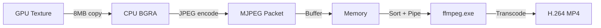
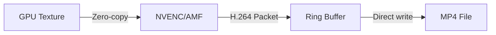

# LiteClip Recorder Performance Analysis

## Executive Summary

This analysis identifies critical performance bottlenecks in LiteClip Recorder and provides prioritized optimization recommendations. The current implementation uses a CPU-bound software encoding pipeline with MJPEG intermediate format, which significantly limits performance.

---

## 1. Capture Pipeline Analysis (`src/capture/dxgi.rs`)

### Current Bottlenecks

#### 1.1 CPU Readback Path - CRITICAL
**Location:** Lines 267-319

The capture performs a full CPU readback of every GPU texture:

```rust
// Copy to staging texture
state.d3d_context.CopyResource(Some(&staging_resource), Some(&captured_resource));

// Flush to ensure copy completes
state.d3d_context.Flush();

// Map and copy row-by-row
let mut bgra = vec![0u8; row_bytes * height];  // ~8MB allocation per frame at 1080p
for row in 0..height {
    std::ptr::copy_nonoverlapping(...);
}
```

**Impact:**
- ~8MB heap allocation per frame at 1080p (1920×1080×4 bytes)
- GPU-CPU synchronization via `Flush()` blocks capture thread
- Row-by-row copy prevents SIMD optimization
- At 60 FPS, this is 480 MB/s of memory allocation and copying

#### 1.2 Frame Channel Memory Pressure
**Location:** Line 64

```rust
let (frame_tx, frame_rx) = bounded::<CapturedFrame>(64);
```

Each `CapturedFrame` contains both a GPU texture AND ~8MB of CPU BGRA data. With 64 buffer slots, this could consume up to 512MB just for the channel.

#### 1.3 Sleep-Based Frame Timing
**Location:** Lines 443-446

```rust
let elapsed = start_time.elapsed();
if elapsed < frame_duration {
    std::thread::sleep(frame_duration - elapsed);
}
```

Sleep-based timing is imprecise (OS scheduler granularity ~1-15ms) and causes frame time variance.

### Optimization Recommendations

| Priority | Optimization | Expected Impact |
|----------|-------------|-----------------|
| **P0** | Implement zero-copy GPU path - pass texture references to hardware encoder | Eliminates 8MB/frame copy, removes GPU-CPU sync |
| **P1** | Use DXGI frame timing APIs instead of sleep | More precise frame timing, reduced jitter |
| **P2** | Reduce channel buffer size to 4-8 frames | Lower memory pressure, faster feedback on encoder overload |

---

## 2. Encoder Analysis (`src/encode/`)

### Current Architecture

The encoder uses a parallel JPEG worker pool, but the hardware encoders are **stub implementations**:

```rust
// hw_encoder.rs - ALL hardware encoders are stubs!
impl Encoder for NvencEncoder {
    fn encode_frame(&mut self, _frame: &crate::capture::CapturedFrame) -> Result<()> {
        trace!("NVENC encoding frame {}", self.frame_count);
        self.frame_count += 1;
        Ok(())  // Does nothing!
    }
}
```

### Current Bottlenecks

#### 2.1 MJPEG Software Encoding - CRITICAL
**Location:** `src/encode/sw_encoder.rs`, lines 22-102

The software encoder converts BGRA → JPEG for every frame:

```rust
fn bgra_to_jpeg_reuse(...) -> Result<Vec<u8>> {
    // 1. BGRA → RGB conversion (or bilinear downscale)
    rgb_buf.resize(rgb_len, 0);
    
    // 2. JPEG compression via image crate
    let mut enc = JpegEncoder::new_with_quality(&mut out, quality);
    enc.encode(rgb_buf, out_w as u32, out_h as u32, ExtendedColorType::Rgb8)?;
}
```

**Impact:**
- JPEG encoding is CPU-intensive (~2-5ms per 1080p frame on modern CPU)
- `image` crate is not optimized for real-time encoding
- At 60 FPS with 4 workers, each worker must encode 15 FPS
- Bilinear downscaling adds significant CPU overhead

#### 2.2 Frame Drops Under Load
**Location:** `src/encode/sw_encoder.rs`, lines 341-345

```rust
if self.worker_tx.try_send(item).is_err() {
    trace!("Workers busy, dropping frame {}", self.frame_count);
}
```

Non-blocking send drops frames silently when workers are busy.

#### 2.3 No Hardware Encoding
**Location:** `src/encode/hw_encoder.rs`

All hardware encoders (NVENC, AMF, QSV) are stub implementations that do nothing. The `detect_hardware_encoder()` function always returns `HardwareEncoder::None`.

### Optimization Recommendations

| Priority | Optimization | Expected Impact |
|----------|-------------|-----------------|
| **P0** | Implement real NVENC/AMF/QSV encoding via FFmpeg | 10-20x encoding speedup, offloads CPU entirely |
| **P0** | Use H.264/H.265 directly instead of MJPEG | Better compression, standard format, no transcoding |
| **P1** | Implement proper hardware detection via FFmpeg | Enable automatic hardware encoder selection |
| **P2** | Add frame queue metrics for monitoring | Visibility into encoder backlog |

---

## 3. Muxer Analysis (`src/clip/muxer.rs`)

### Current Architecture

The muxer spawns an external `ffmpeg.exe` process and pipes MJPEG frames for transcoding to H.264:

```rust
let mut command = Command::new(&ffmpeg_cmd);
command
    .arg("-f").arg("mjpeg")
    .arg("-i").arg("pipe:0")
    .arg("-c:v").arg("libx264")  // Re-encodes MJPEG → H.264
    .arg("-preset").arg("fast");
```

### Current Bottlenecks

#### 3.1 Transcoding Overhead - CRITICAL
**Location:** Lines 216-248

The muxer:
1. Buffers ALL frames in memory (`video_packets: Vec<EncodedPacket>`)
2. Spawns external FFmpeg process
3. Pipes MJPEG frames via stdin
4. Transcodes MJPEG → H.264 via libx264

**Impact:**
- Double encoding loss: Original → JPEG → H.264
- libx264 is CPU-intensive during muxing
- Process spawn overhead (~50-100ms)
- Pipe overhead for stdin/stdout
- All frames held in memory until muxing completes

#### 3.2 Memory Consumption
**Location:** Lines 76, 124

```rust
video_packets: Vec<EncodedPacket>,  // Holds ALL frames

self.video_packets.push(packet.clone());  // Clones every packet
```

For 120 seconds at 30 FPS with ~100KB JPEG frames: ~360MB just for video packets.

#### 3.3 Sorting Overhead
**Location:** Line 183

```rust
self.video_packets.sort_by_key(|packet| packet.pts);
```

O(n log n) sort of all packets before muxing.

### Optimization Recommendations

| Priority | Optimization | Expected Impact |
|----------|-------------|-----------------|
| **P0** | Write H.264 packets directly to MP4 | Eliminate transcoding entirely |
| **P0** | Use FFmpeg libavformat directly in-process | Remove process spawn and pipe overhead |
| **P1** | Stream packets to disk during save | Reduce peak memory usage |
| **P2** | Use faster preset or hardware encoding for muxing | Faster clip finalization |

---

## 4. Ring Buffer Analysis (`src/buffer/ring.rs`)

### Current Bottlenecks

#### 4.1 Keyframe Index Rebuild - MODERATE
**Location:** Lines 188-193

```rust
fn evict_oldest(&mut self) {
    // ... remove oldest packet ...
    
    // Rebuild entire index!
    self.keyframe_index = self.keyframe_index
        .iter()
        .map(|(&ts, &idx)| (ts, idx.saturating_sub(1)))
        .filter(|(_, idx)| *idx > 0)
        .collect();
}
```

Every eviction triggers O(n) index rebuild where n = number of keyframes.

#### 4.2 Write Lock Contention
**Location:** Line 45

```rust
pub fn push(&self, packet: EncodedPacket) {
    self.inner.write().push(packet);  // Blocks all readers
}
```

Every packet push acquires a write lock, blocking snapshot operations.

#### 4.3 Conservative Memory Default
**Location:** `src/config.rs`, line 321

```rust
fn default_memory_limit() -> u32 {
    512  // 512 MB - very conservative for modern systems
}
```

### Optimization Recommendations

| Priority | Optimization | Expected Impact |
|----------|-------------|-----------------|
| **P1** | Use VecDeque with head index instead of rebuilding | O(1) eviction instead of O(n) |
| **P2** | Increase default memory limit to 2GB | More frame retention |
| **P2** | Use read-copy-update pattern for snapshots | Reduce lock contention |

---

## 5. Configuration Analysis (`src/config.rs`)

### Current Defaults

| Setting | Current Value | Recommended for 60 FPS |
|---------|--------------|------------------------|
| `framerate` | 30 | **60** |
| `bitrate_mbps` | 20 | **50** (for 1080p60) |
| `memory_limit_mb` | 512 | **2048** |
| `keyframe_interval_secs` | 1 | 1 (good) |
| `resolution` | Native | Native (good) |

### Optimization Recommendations

| Priority | Setting | Change | Impact |
|----------|---------|--------|--------|
| **P1** | `framerate` | 30 → 60 | Target framerate achieved |
| **P1** | `bitrate_mbps` | 20 → 50 | Better quality at 60 FPS |
| **P2** | `memory_limit_mb` | 512 → 2048 | More frame retention |

---

## 6. Architectural Issues

### 6.1 Data Flow Inefficiency



**Problems:**
1. GPU → CPU copy is unnecessary with hardware encoding
2. MJPEG intermediate format requires transcoding
3. External process adds latency

### 6.2 Recommended Architecture



**Benefits:**
1. No GPU → CPU copy
2. No transcoding
3. Minimal CPU usage
4. Lower latency

---

## 7. Priority-Ranked Optimization Summary

### P0 - Critical (Required for 60 FPS)

1. **Implement Real Hardware Encoding**
   - Replace stub NVENC/AMF/QSV with actual FFmpeg implementations
   - Use `h264_nvenc`, `h264_amf`, or `h264_qsv` codecs
   - Expected: 10-20x encoding performance improvement

2. **Zero-Copy GPU Path**
   - Pass D3D11 texture references directly to hardware encoder
   - Eliminate 8MB/frame CPU copy
   - Expected: 50% reduction in memory bandwidth

3. **Direct H.264 Output**
   - Encode directly to H.264 instead of MJPEG
   - Write packets directly to MP4 via libavformat
   - Expected: Eliminate transcoding, faster muxing

### P1 - High Impact

4. **Update Default Configuration**
   - Change framerate default to 60
   - Increase bitrate to 50 Mbps for 1080p60
   - Increase memory limit to 2GB

5. **Optimize Keyframe Index**
   - Use incremental index updates instead of full rebuild
   - Expected: O(1) eviction instead of O(n)

6. **Implement Hardware Detection**
   - Probe FFmpeg for available hardware encoders
   - Auto-select best available encoder

### P2 - Moderate Impact

7. **Improve Frame Timing**
   - Use DXGI frame timing or multimedia timer
   - Expected: More consistent frame intervals

8. **Streaming Muxing**
   - Write frames to MP4 as they arrive during save
   - Expected: Lower peak memory during clip save

9. **Reduce Channel Buffer Sizes**
   - Frame channel: 64 → 8
   - Faster feedback on pipeline overload

---

## 8. Quick Wins (Immediate Improvements)

These changes can be made immediately without architectural changes:

1. **Config Changes** (edit `src/config.rs`):
   ```rust
   fn default_framerate() -> u32 { 60 }
   fn default_bitrate() -> u32 { 50 }
   fn default_memory_limit() -> u32 { 2048 }
   ```

2. **Muxer Preset** (edit `src/clip/muxer.rs`):
   ```rust
   .arg("-preset").arg("ultrafast")  // Change from "fast"
   .arg("-crf").arg("23")            // Change from 18 for speed
   ```

3. **JPEG Quality** (edit `src/encode/sw_encoder.rs`):
   ```rust
   let quality = 85u8;  // Change from 92 for faster encoding
   ```

---

## 9. Conclusion

The current implementation is fundamentally limited by:

1. **CPU-bound encoding** - MJPEG via image crate is too slow for 60 FPS
2. **Unnecessary data copies** - GPU→CPU readback wastes bandwidth
3. **Transcoding pipeline** - MJPEG→H.264 doubles encoding work

The highest-impact optimization is implementing real hardware encoding (NVENC/AMF/QSV) with direct H.264 output. This would:
- Eliminate CPU encoding bottleneck
- Remove GPU→CPU copy overhead  
- Enable direct MP4 writing without transcoding
- Make 60 FPS easily achievable on modern hardware

Without hardware encoding, achieving 60 FPS would require significant CPU optimization (SIMD, multithreading improvements) and would still consume substantial CPU resources that could impact game performance.
