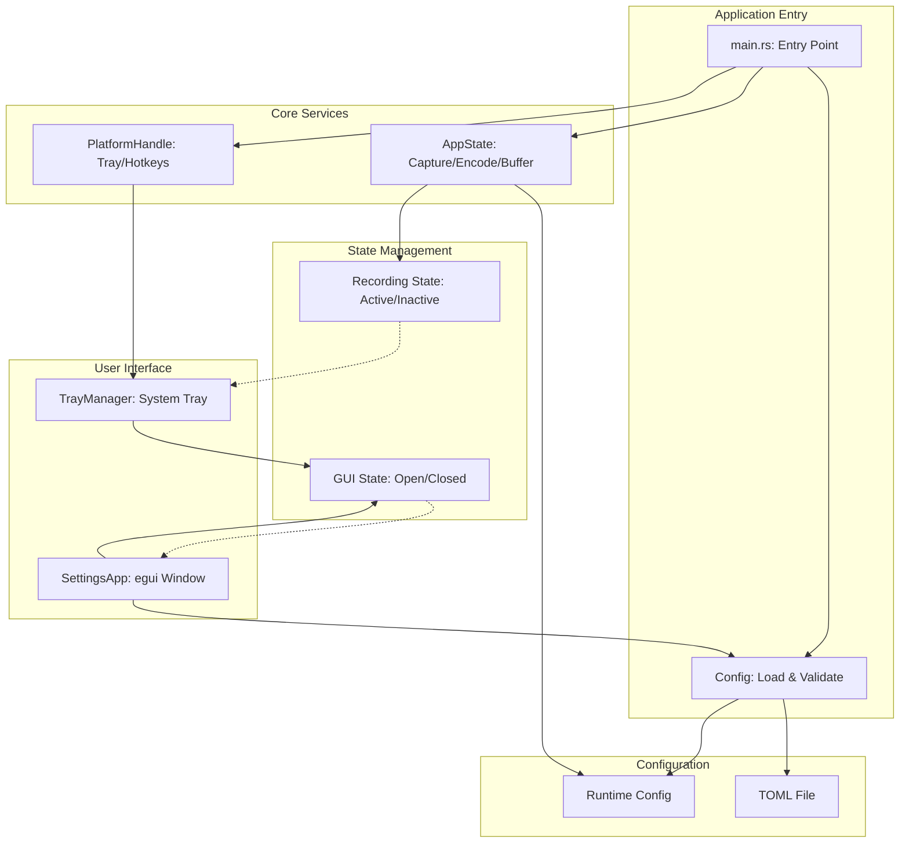
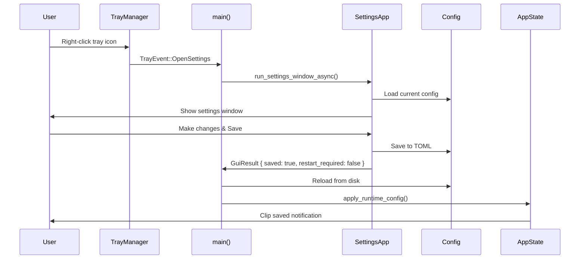
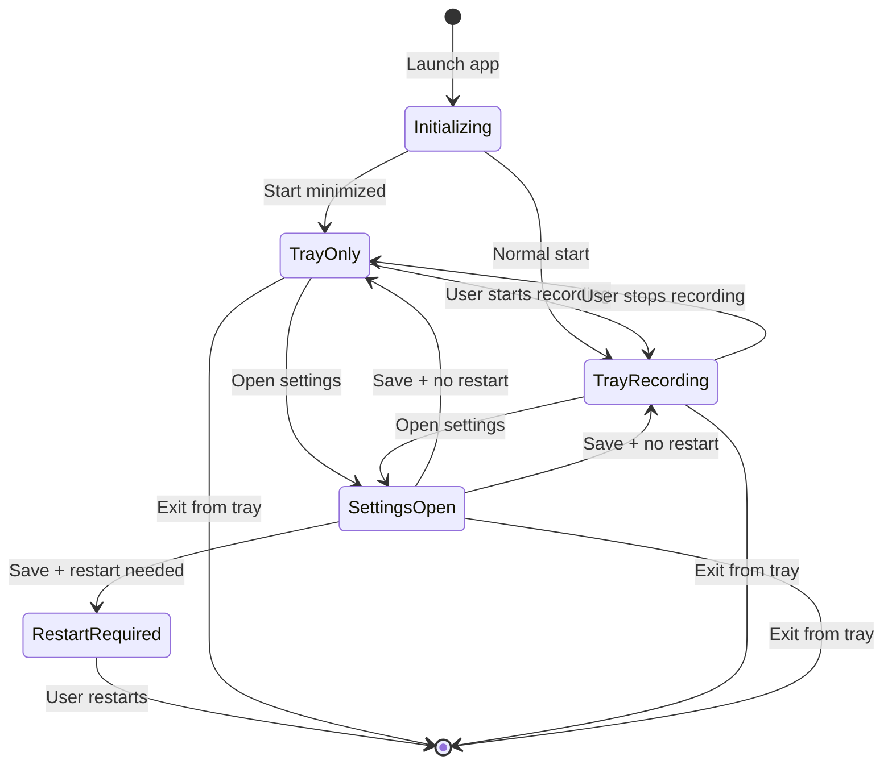

# Tray-Centric Integration Architecture

## Overview

This document outlines the architecture for integrating the LiteClip Replay UI with the main application to create a tray-centric user experience. The app will launch directly into the system tray with no initial window, and settings will be accessible via the tray menu.

## Current State Analysis

### Existing Components

1. **Settings UI** ([`src/gui/app.rs`](src/gui/app.rs:1))
   - Standalone egui/eframe application
   - [`run_settings_window_async()`](src/gui/app.rs:937) spawns GUI in blocking task
   - Returns [`GuiResult`](src/gui/app.rs:16) with saved config and restart_required flag
   - Supports dirty tracking, cancel/reset, and restart detection

2. **System Tray** ([`src/platform/tray.rs`](src/platform/tray.rs:1))
   - Already implemented with menu items: Settings, Save Clip, Toggle Recording, Exit
   - Sends [`TrayEvent`](src/platform/mod.rs:34) via channel
   - Handles WM_TRAY_CALLBACK messages

3. **Main Application** ([`src/main.rs`](src/main.rs:1))
   - Currently supports `--gui` flag for settings-only mode
   - Otherwise starts capture/recording immediately
   - Already handles [`TrayEvent::OpenSettings`](src/main.rs:178)
   - [`handle_open_settings()`](src/main.rs:259) spawns GUI and applies changes

4. **Configuration System** ([`src/config/mod.rs`](src/config/mod.rs:1))
   - Stored at `%APPDATA%\liteclip-replay\liteclip-replay.toml`
   - Supports runtime changes for some settings
   - Validates and clamps values to safe ranges

5. **App State** ([`src/app.rs`](src/app.rs:1))
   - Manages capture, encoding, and buffer
   - [`apply_runtime_config()`](src/app.rs:292) applies changes without restart
   - Supports both hardware pull mode and CPU capture mode

### Current Behavior

- Without `--gui`: Starts capture immediately, shows tray icon
- With `--gui`: Opens settings only, no tray, no capture
- Settings changes: Applied immediately if possible, restart required for some

### Required Changes

1. **Default Launch Mode**: Start in tray with capture active
2. **Configuration**: Add "Start Minimized" option
3. **Tray Menu**: Add explicit Start/Stop Recording items
4. **Lifecycle**: Ensure clean shutdown from tray

## Proposed Architecture

### Component Structure



### Component Responsibilities

#### Main Application ([`main.rs`](src/main.rs:1))
- **Entry Point**: [`main()`](src/main.rs:16) function
- **Configuration**: Load and validate [`Config`](src/config/mod.rs:1)
- **Platform Setup**: Spawn platform thread with [`PlatformHandle`](src/platform/mod.rs:81)
- **State Management**: Create [`AppState`](src/app.rs:21) and manage lifecycle
- **Event Loop**: Handle events from tray, hotkeys, and GUI
- **Shutdown**: Clean shutdown of all components

#### App State ([`app.rs`](src/app.rs:1))
- **Capture Management**: Start/stop [`DxgiCapture`](src/capture/dxgi/mod.rs:1)
- **Encoding Management**: Start/stop encoder threads
- **Buffer Management**: [`SharedReplayBuffer`](src/buffer/ring/mod.rs:1) lifecycle
- **Audio Management**: [`WasapiAudioManager`](src/capture/audio/manager.rs:1)
- **Configuration**: Apply runtime config changes
- **State Tracking**: Recording active/inactive state

#### Platform Layer ([`platform/mod.rs`](src/platform/mod.rs:1))
- **Tray Management**: [`TrayManager`](src/platform/tray.rs:32) for system tray
- **Hotkey Management**: Global hotkey registration
- **Event Routing**: Bridge between Windows messages and Rust channels
- **Command Interface**: [`PlatformCommand`](src/platform/mod.rs:14) for runtime changes

#### Settings UI ([`gui/app.rs`](src/gui/app.rs:1))
- **Configuration Editor**: Full settings editor with tabs
- **Validation**: Real-time validation and clamping
- **Dirty Tracking**: Track unsaved changes
- **Restart Detection**: Identify settings requiring restart
- **Persistence**: Save to TOML file

#### Configuration System ([`config/mod.rs`](src/config/mod.rs:1))
- **Storage**: TOML-based configuration at `%APPDATA%\liteclip-replay\liteclip-replay.toml`
- **Validation**: [`validate()`](src/config/config_mod/types.rs:98) method
- **Defaults**: Reasonable defaults for all settings
- **Serialization**: Serde-based serialization

### Communication Flow



### State Management

#### GUI State
- **Single Instance**: Prevent multiple settings windows
- **Open/Closed Tracking**: [`gui_open`](src/main.rs:111) flag
- **Modal Behavior**: GUI is modal to main app

#### Recording State
- **Active/Inactive**: [`is_recording`](src/app.rs:27) flag
- **Tray Menu Updates**: Dynamic menu items based on state
- **Hotkey Availability**: Hotkeys work regardless of GUI state

#### Configuration State
- **Runtime Config**: Current active configuration
- **Disk Config**: Saved configuration in TOML
- **Pending Changes**: Unsaved changes in GUI

### App Lifecycle



### Implementation Strategy

#### Phase 1: Add Start/Stop Recording Menu Items

**Tray Menu Changes** ([`src/platform/tray.rs`](src/platform/tray.rs:1)):
```rust
// Add new menu item IDs
const MENU_ITEM_START_RECORDING: u32 = 1005;
const MENU_ITEM_STOP_RECORDING: u32 = 1006;

// Add to TrayEvent enum
pub enum TrayEvent {
    // ... existing variants
    StartRecording,
    StopRecording,
}

// Update show_menu() to include dynamic items
pub fn show_menu(&self, x: i32, y: i32, event_tx: &Sender<AppEvent>) -> Result<()> {
    // ... existing code
    
    // Add dynamic recording control
    if is_recording {
        Self::append_menu_string(hmenu, MENU_ITEM_STOP_RECORDING, "Stop Recording")?;
    } else {
        Self::append_menu_string(hmenu, MENU_ITEM_START_RECORDING, "Start Recording")?;
    }
    
    // ... rest of menu
}
```

**Main Event Loop** ([`src/main.rs`](src/main.rs:136)):
```rust
TrayEvent::StartRecording => {
    info!("Tray: Start Recording selected");
    let mut state = app_state.write().await;
    if let Err(e) = state.start_recording().await {
        error!("Failed to start recording: {}", e);
    }
}
TrayEvent::StopRecording => {
    info!("Tray: Stop Recording selected");
    let mut state = app_state.write().await;
    if let Err(e) = state.stop_recording().await {
        error!("Failed to stop recording: {}", e);
    }
}
```

#### Phase 2: Add Start Minimized Configuration

**Configuration Changes** ([`src/config/config_mod/types.rs`](src/config/config_mod/types.rs:49)):
```rust
#[derive(Debug, Clone, Serialize, Deserialize)]
pub struct GeneralConfig {
    // ... existing fields
    #[serde(default = "default_true")]
    pub start_minimised: bool,
}

// Add default function
fn default_true() -> bool { true }
```

**Main Function** ([`src/main.rs`](src/main.rs:16)):
```rust
async fn main() -> Result<()> {
    // ... load config
    
    // Check if we should start minimized
    if config.general.start_minimised {
        info!("Starting minimized to system tray");
        // Start without showing any window
    } else {
        // Show initial window or notification
    }
    
    // ... rest of startup
}
```

#### Phase 3: Refactor Main for Tray-Centric Lifecycle

**Current Flow**:
1. Parse args
2. Load config
3. If `--gui`: Open settings only
4. Else: Start capture + tray

**New Flow**:
1. Parse args
2. Load config
3. Start platform (tray + hotkeys)
4. If `--gui`: Open settings window
5. If not `start_minimised`: Show welcome notification
6. Start capture if `auto_start` (default: true)
7. Enter event loop

**Key Changes**:
- Always start platform (tray + hotkeys)
- Settings window is optional, not exclusive
- Capture starts by default, can be disabled
- Clean shutdown from tray

### Communication Patterns

#### Settings Changes Flow

1. User opens settings from tray
2. [`handle_open_settings()`](src/main.rs:259) spawns GUI
3. GUI loads current config from disk
4. User makes changes and saves
5. GUI saves to TOML file
6. GUI returns [`GuiResult`](src/gui/app.rs:16)
7. Main reloads config from disk
8. Main calls [`apply_runtime_config()`](src/app.rs:292)
9. Runtime changes applied immediately
10. If restart required, show notification

#### Recording Control Flow

1. User clicks "Start Recording" in tray
2. Tray sends [`TrayEvent::StartRecording`](src/platform/mod.rs:34)
3. Main receives event in event loop
4. Main calls [`start_recording()`](src/app.rs:110)
5. AppState starts capture + encoding
6. Tray menu updates to show "Stop Recording"
7. User can now save clips via hotkey or tray

#### Shutdown Flow

1. User clicks "Exit" in tray
2. Tray sends [`TrayEvent::Exit`](src/platform/mod.rs:34)
3. Main receives event
4. Main calls [`stop_recording()`](src/app.rs:170)
5. AppState stops all components
6. Main calls [`platform_handle.join()`](src/platform/mod.rs:111)
7. Platform thread exits
8. Application terminates

### Error Handling

#### GUI Errors
- If GUI fails to open: Log error, show tray notification
- If GUI crashes: Mark as closed, allow reopening
- If settings save fails: Log error, continue with current config

#### Recording Errors
- If capture fails: Log error, show tray notification
- If encoding fails: Log error, stop recording gracefully
- If buffer error: Log error, attempt recovery

#### Configuration Errors
- If config load fails: Use defaults, log warning
- If config save fails: Log error, continue with current config
- If runtime config apply fails: Log error, revert to previous config

### Testing Strategy

#### Unit Tests
- Config validation and defaults
- Tray event handling
- GUI state management
- Runtime config application

#### Integration Tests
- Full startup/shutdown cycle
- Settings changes without restart
- Settings changes requiring restart
- Recording start/stop from tray
- Clip saving from tray and hotkey

#### Manual Tests
1. Launch app → Verify tray icon appears
2. Right-click tray → Verify menu shows "Stop Recording"
3. Click "Settings" → Verify settings window opens
4. Change audio volume → Verify change applies immediately
5. Change resolution → Verify restart notification
6. Click "Save Clip" → Verify clip saves
7. Click "Stop Recording" → Verify menu changes
8. Click "Exit" → Verify clean shutdown

### Performance Considerations

#### Memory Usage
- GUI only loaded when needed
- Settings window closed after use
- No persistent GUI resources

#### CPU Usage
- No polling for GUI state
- Event-driven architecture
- Efficient channel usage

#### Disk I/O
- Config loaded once at startup
- Config saved only on explicit save
- No frequent disk access

### Security Considerations

#### Configuration Security
- Config file in user app data directory
- No sensitive data in config
- Validation prevents malicious values

#### Process Security
- No elevated privileges required
- Standard user permissions sufficient
- Tray icon visible to user

### Future Enhancements

#### Notification System
- Toast notifications for clip saves
- Error notifications for failures
- Status notifications for recording state

#### Auto-Start with Windows
- Registry entry for startup
- Configurable in settings
- Start minimized option

#### Multiple Profiles
- Save/load different config profiles
- Quick switch from tray
- Profile-specific hotkeys

### Conclusion

This architecture provides a clean, user-friendly tray-centric experience while maintaining all existing functionality. The app launches directly to the system tray with capture active, settings are accessible via the tray menu, and the UI can be opened and closed without affecting the main application. All settings changes are properly applied, with restart required only for settings that cannot be changed at runtime.